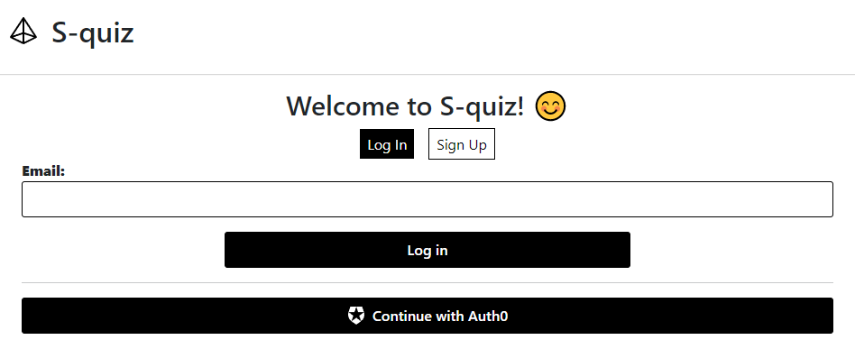
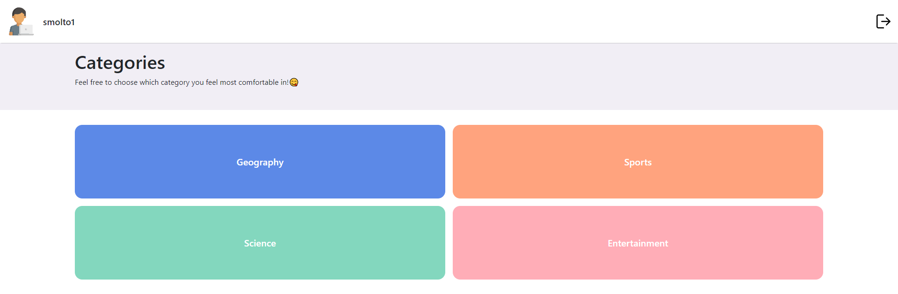
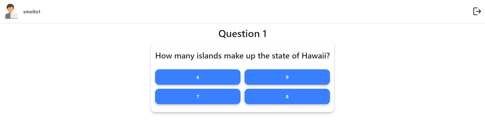
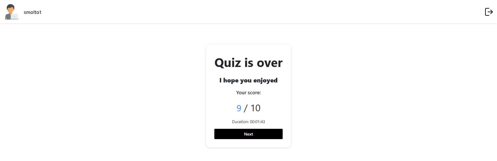

# Trivial clone

This project was created using Next.js Framework.

It is a clone of trivial where a user has 4 different categories to choose and each one has 10 different questions. At the end of the questionnaire the user gets their final score.

## Web

### Login Page

---

### Categories Page

---

### Question Page

---

### Score Page

## Start the project

### `npm install`

To install the project.

### `npm run dev`

Runs the app in the development mode.\
Open [http://localhost:3000](http://localhost:3000) to view it in the browser.

### `npm run build`

Builds the app for production to the `build` folder.\

## Configure the project

If you configure a .env file (just copy .env over to '.env.local' and fill in the options).
